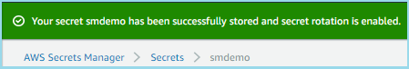

<!--                                                                                       -->
<!-- Copyright 2018 Amazon.com, Inc. or its affiliates. All Rights Reserved.               -->
<!--                                                                                       -->
<!-- Permission is hereby granted, free of charge, to any person obtaining a copy of this  -->
<!-- software and associated documentation files (the "Software"), to deal in the Software -->
<!-- without restriction, including without limitation the rights to use, copy, modify,    -->
<!-- merge, publish, distribute, sublicense, and/or sell copies of the Software, and to    -->
<!-- permit persons to whom the Software is furnished to do so.                            -->
<!--                                                                                       -->
<!-- THE SOFTWARE IS PROVIDED "AS IS", WITHOUT WARRANTY OF ANY KIND, EXPRESS OR IMPLIED,   -->
<!-- INCLUDING BUT NOT LIMITED TO THE WARRANTIES OF MERCHANTABILITY, FITNESS FOR A         -->
<!-- PARTICULAR PURPOSE AND NONINFRINGEMENT. IN NO EVENT SHALL THE AUTHORS OR COPYRIGHT    -->
<!-- HOLDERS BE LIABLE FOR ANY CLAIM, DAMAGES OR OTHER LIABILITY, WHETHER IN AN ACTION     -->
<!-- OF CONTRACT, TORT OR OTHERWISE, ARISING FROM, OUT OF OR IN CONNECTION WITH THE        -->
<!-- SOFTWARE OR THE USE OR OTHER DEALINGS IN THE SOFTWARE.                                -->
<!--                                                                                       -->
# ___AWS Secrets Manager Workshop___

# Module 1 - Rotating the secret for a publicly-facing Amazon RDS database

### Introduction

This module shows how to use AWS Secrets Manager for rotating the password for a publicly-facing Amazon RDS database.  Thi is similar to 

### Architecture Overview

Here's a diagram of what we are going to build.


This environment consists of a VPC in the us-east-1 region with two public subnets.  One subnet containts an Amazon EC2 bastion host running Amazon Linux 2 used for running AWS CLI commands.  The other subnet contains an Amazon RDS MySQL database instance.  Both subnets are exposed to the internet. When we initiate a rotation of the RDS database, the AWS Lambda function that Secrets Manager uses will reach out to the Amazon RDS database to perform the rotation.

### Security Notes

| **Important Security Notes** | 
| ---------- | 
| |
|**_For the sake of simplicity, the CloudFormation template used in the module creates shell scripts that use *jq* to parse the secret value into shell variables to allow for easy command line manipulation. This is NOT a security best practice for a production environment. In a production environment, we recommend that you don't store passwords in environment variables, and work with them in plaintext at the command line._**
| |
|**_Also, the MySQL database that's configured in this module is OPEN TO THE PUBLIC INTERNET on port 3306, again for simplicity in setup for the module. The Lambda function must be able to access both the public AWS Secrets Manager service endpoint and your database. Making the database publicly accessible is the easiest way to do this.  We strongly recommend that you follow the clean up instructions at the end of this module to remove the CloudFormation stack and the database._**|


### Prerequisites

In order to complete this workshop you'll need the following:
<br />
* an AWS Account with administrator access to services used in the module including AWS Secrets Manager, AWS CloudFormation, Amazon EC2, Amazon RDS, and Amazon VPC
* an [Amazon EC2 key pair](https://docs.aws.amazon.com/AWSEC2/latest/UserGuide/ec2-key-pairs.html) in the region you have chosen to create a bastion instance from which you will execute various commands
* a program (e.g. [putty](https://www.putty.org/) to connect to the Amazon EC2 bastion host using the secure shell (ssh) protocol

### Charges

You will incur charges for the services used in these modules.  The pricing for each service is available on that service's pricing page.

### 1. Choose a region

You need to choose a region that offers AWS Secrets Manager and Amazon RDS.  For information about service availability, check the [region table](https://aws.amazon.com/about-aws/global-infrastructure/regional-product-services/).

**Tip:** The AWS region name is always listed in the upper-right corner of the AWS Management Console, in the navigation bar.

Make a note of the AWS *region name*, for example, *US East (N. Virginia)*. For more information about regions, see: [AWS Regions and Endpoints](http://docs.aws.amazon.com/general/latest/gr/rande.html).

### 2. Complete initial environment configuration
<details open>
<summary><strong>(expand for details)</strong></summary>
<br />

In this section, you will use AWS CloudFormation to build the environment shown in the diagram above.

___Complete all the steps below unless they are marked "optional."___

- __2.1.__ Download the [AWS Cloudformation template](https://github.com/jeffscottlevine/aws-secretsmgr-workshop/blob/master/1_RotatePublicRDS/1_RotatePublicRDS.yaml) and save it to your workstation.

- __2.2.__ In the AWS Management Console, Under Management Tools, Select **CloudFormation**.

- __2.3.__ Click the **Create stack** button.

- __2.4.__ Select the **Upload a template to Amazon S3** radio button.

- __2.5.__ Click the **Choose file** button and use the file navigation pop-up to select the CloudFormation template you just downloaded.

- __2.6.__ Click the **Next** button.

Enter the values below into Stack name and parameter fields:
<br />

| Field name | Value |
| ---------- | ----- |
| Stack name | You can choose or just use **smdemo** |
| Choose an Availability Zone | Select any Availability Zone |
| Choose a second Availability Zone | Select a different Availability Zone |
| Choose a key pair | Select the Amazon EC2 key pair |
| Enter the name of the database | Accept the default value of **smdemo** |
| Enter the TCP port for the database endpoint | Accept the default value of **3306** |
| Enter a prefix for the Name tag | Accept the default value of **smdemo** |
| Enter the value for the Project tag | Accept the default value of **smproj** |

<br />

- __2.7.__ Click the **Next** button.

- __2.8.__ On the Options page, click the **Next** button.

- __2.9.__ On the Review page, check the acknowledgement box and click the **Create** button.  AWS CloudFormation will the build the resource stack.  This may take 15-20 minutes to complete.  Wait until the status of the stack changes to "CREATE_COMPLETE."  You can periodically refresh the page to update the status.   If the stack creation fails, look at the bottom of the page and select the Events tab.   You should be able to see the reason for the failure in the Status Reason column.  A common reason for a failure is not having specified some of the parameters when creating the stack.

- __2.10.__ Let's take a look at the Output section of the CloudFormation stack.


The outputs values include the RDS master username and password, both of which are set to randon alphanumeric strings for added security. You will store the DBUser and DBPassword values as a secret in Secrets Manager.  You will se the DBEndpoint value to help you select the correct database in Secrets Manager.  Another output value is the IP address of the bastion host.  You will need this IP address to set up a connection to the bastion host later in this module.  Keep this window open.
</details>

### 3. Store the secret value in AWS Secrets Manager

<details open>
<summary><strong>(expand for details)</strong></summary>
<br />

In this section, you will store the RDS database credentials in AWS Secrets Manager.  You will use the DBUser and DBPassword values that were output from the AWS CloudFormation.

- __3.1.__ Open the [AWS Secrets Manager Console](https://console.aws.amazon.com/secretsmanager/home) in a new tab or window.

- __3.2.__ Click **Store a new secret**.

- __3.3.__ Select the **Credentials for RDS database** radio button.

- __3.4.__ Copy the values for the DBUser and DBPassword CloudFormation output values that you got from item 2.10 above into the **User name** and **Password** fields respectively.   Scroll down to the bottom of the page and you will see a list of your RDS instances.  Using the DBendpoint output value that you got from item 2.10 above, select the RDS instance.


- __3.5.__ Click **Next**.

- __3.6.__ Enter a name for the secret.  You can pick a name or just use **smdemo** as shown below.


- __3.7.__ Click **Next**.

- __3.8__ Select **Disable automatic rotation** and then click **Next**.   We will enable rotation later in this module.


- __3.9.__ Click **Store**.

You have now stored your secret value as shown below.


</details>

### 4. Connect to the Amazon EC2 bastion host and access the RDS database

<details open>
<summary><strong>(expand for details)</strong></summary>
<br />

In this section, you will connect to the bastion host so you can run scripts that the CloudFormation template has created on the instance.

___Complete all the steps below unless they are marked "optional."___

- __4.1.__ Locate the Amazon EC2 key pair thst you provided to AWS CloudFormation.

- __4.2.__ Locate the IP address of the bastion host that appears as an output to AWS CloudFormation

- __4.3.__ [Connect to the bastion host](https://docs.aws.amazon.com/AWSEC2/latest/UserGuide/AccessingInstances.html) using the EC2 key pair and the IP address.  Your user ID will be **ec2-user@X.X.X.X** where X.X.X.X is the bastion IP address.  Remain logged in for the remainder of this module.

- __4.4.__ Use the **ls** command to list the contents of the home directory.  You will see two shell scripts.

  * mysql.oldway.sh - This shell script connects to the database the "old" way, using a hard-coded password.
  
  * mysql.newway.sh - This shell script connects to the database the "new" way, using AWS Secrets Manager.
  
- __4.5.__ Let's take a look at the file mysql.oldway.sh.  You can use the **cat** command to do this.  In the example below, the values PASSWORD, USER, and ENDPOINT represent the hard-coded database password, username, and host endpoint.

```

#/bin/bash

# mysql.oldway.sh

# This is the old way of accessing a database, with a hard-coded password.
# This script will only work right after the CloudFormation template runs.
# After you store and rotate the secret, you will need to use the
# mysql.newway.sh script.

mysql \
-pPASSWORD \
-u USER \
-P 3306 \
-h ENDPOINT

$

```

- __4.6.__ Now let's try this script by running the following commands.  The first command invokes the script.  The subsequent commands select the database, display the table names in the database, query the rows in the table, and exit MySQL.

```
./mysql.oldway.sh
use smdemo;
show tables;
select * from bookinfo;
quit;
```

You can see an example of the output below.  This shows that you can access the database, the "old" way, with a hard-coded user name and password. You may be wondering why MariaDB appears in the image below.  Amazon Linux 2 includes the MariaDB port of the **mysql** command as an "extras" module.  The **mysql** program is compatible with both MySQL and MariaDB.


- __4.7.__ Let's take a look at the file mysql.newway.sh.  You can use the **cat** command to do this.  As mentioned above, for the sake of simplicity, the scripts used in the tutorial use *jq* to parse the secret value into shell variables to allow for easy command line manipulation. This is NOT a security best practice for a production environment. In a production environment, we recommend that you don't store passwords in environment variables, and work with them in plaintext at the command line.

```
$ cat mysql.newway.sh

#/bin/bash

# This is the new way of accessing a database, with AWS Secrets Manager.

if [ $# -ne 1 ]
then
  echo usage: $0 SecretName
  exit 1
fi

secret=$(aws secretsmanager get-secret-value --secret-id $1 --region us-east-1 | jq .SecretString | jq fromjson)
user=$(echo $secret | jq -r .username)
password=$(echo $secret | jq -r .password)
endpoint=$(echo $secret | jq -r .host)
port=$(echo $secret | jq -r .port)

mysql \
-p$password \
-u $user \
-P $port \
-h $endpoint

$
```

- __4.8.__ Now let's try this script by running the following commands.  The first command invokes the script.  **Note that you must specify the name of the secret!** The subsequent commands select the database, display the table names in the database, query the rows in the table, and exit MySQL.

```
./mysql.newway.sh smdemo
use smdemo;
show tables;
select * from bookinfo;
quit;
```

You can see an example of the output below.  This shows that you can access the database, the "new" way, using AWS Secrets Manager.


</details>

### 5. Enable AWS Secrets Manager and perform the first password rotation

<details open>
<summary><strong>(expand for details)</strong></summary>
<br />

In this section, you will enable the rotation of the secret you created in AWS Secrets Manager.

- __5.1.__ Go to the main screen of the AWS Secrets Manager console.

- __5.2.__ Click on the secret that you previously created.

- __5.3.__ Click **Edit rotation**.

- __5.4.__ Select **Enable automatic rotation**. Choose **30 days** for the rotation interval.  Click **Use this secret** because we will be using the credentials of this secret to access the database and then rotate the same credentials.  Click **Save** to begin the process.


- __5.5.__ You will see a message telling you that the rotation is beginning and that you should remain on the page until it is complete.


A message will appear when the rotation is complete.



- __5.6.__ Click **Retrieve secret value** to see the new password value.

</details>

### 6. Connect to the database after rotating the password

<details open>
<summary><strong>(expand for details)</strong></summary>
<br />

Let's try to connect to the database again, both the "old" way with a hard-coded password, the "new" way with AWS Secrets Manager.

- __6.1.__ On the bastion host, repeat step 4.6 with the **mysql.oldway.sh** script.   You should receive an error message (access denied) because the mysql.oldway.sh script has the same hard-coded password.


- __6.2.__ Repeat step 4.8 with the **mysql.newway.sh** script.   You should be able to connect to the database just as you did before since this script uses AWS Secrets Manager to fetch the updated credentials.

</details>

### 7. Clean up

| **Important Security Note** |
| --------------------------- |
| |
| **_Now that you have seen how AWS Secrets Manager can rotate the credentials for a publicly-facing database, please follow these steps to remove the resources you created, including the publicly-facing database._** |

- __7.1.__ [Delete the CloudFormation stack](https://docs.aws.amazon.com/AWSCloudFormation/latest/UserGuide/cfn-console-delete-stack.html) that you created in steps 2.1 through 2.9.  The stack deletion process may take several minutes to complete.

- __7.2.__ [Delete the secret you created in Secrets Manager](https://docs.aws.amazon.com/secretsmanager/latest/userguide/manage_delete-restore-secret.html?shortFooter=true).  Note that when you delete a secret, the deletion is scheduled for a minimum of seven days in the future.

- __7.3.__ When you enabled rotation on your secret, AWS Secrets Manager used AWS CloudFormation to create an AWS Lambda function to do the rotation using the [AWS Serverless Application Repository](https://aws.amazon.com/serverless/serverlessrepo/).  Go to the AWS CloudFormation console and delete this stack as well.  The name of the stack begins with the following string:

  **aws-serverless-repository-SecretsManagerRDSMySQLRotationSingleUser**

  Look for a stack with this naming convention that was created at about the same time as you enabled rotation.

### 8. Conclusion

You have completed this module. Visit the [main Secrets Managager workshop site](https://github.com/jeffscottlevine/aws-secretsmgr-workshop/) for more workshops as they become available.
