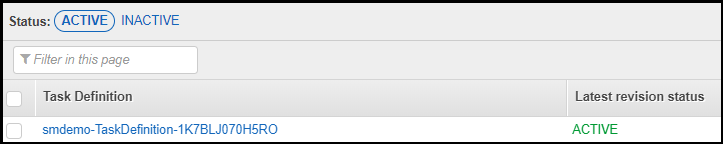

<!--                                                                                       -->
<!-- Copyright 2018 Amazon.com, Inc. or its affiliates. All Rights Reserved.               -->
<!--                                                                                       -->
<!-- Permission is hereby granted, free of charge, to any person obtaining a copy of this  -->
<!-- software and associated documentation files (the "Software"), to deal in the Software -->
<!-- without restriction, including without limitation the rights to use, copy, modify,    -->
<!-- merge, publish, distribute, sublicense, and/or sell copies of the Software, and to    -->
<!-- permit persons to whom the Software is furnished to do so.                            -->
<!--                                                                                       -->
<!-- THE SOFTWARE IS PROVIDED "AS IS", WITHOUT WARRANTY OF ANY KIND, EXPRESS OR IMPLIED,   -->
<!-- INCLUDING BUT NOT LIMITED TO THE WARRANTIES OF MERCHANTABILITY, FITNESS FOR A         -->
<!-- PARTICULAR PURPOSE AND NONINFRINGEMENT. IN NO EVENT SHALL THE AUTHORS OR COPYRIGHT    -->
<!-- HOLDERS BE LIABLE FOR ANY CLAIM, DAMAGES OR OTHER LIABILITY, WHETHER IN AN ACTION     -->
<!-- OF CONTRACT, TORT OR OTHERWISE, ARISING FROM, OUT OF OR IN CONNECTION WITH THE        -->
<!-- SOFTWARE OR THE USE OR OTHER DEALINGS IN THE SOFTWARE.                                -->
<!--                                                                                       -->
# RDS and Fargate Round - Fargate Phase

## Prerequisites

1. You must complete the RDS phase of this workshop round before starting this phase.

2. You should be familiar with Docker concepts.

## Overview

In this phase, you will learn how to use AWS Secrets Manager with AWS Fargate.  AWS Fargate is a compute engine for Amazon Elastic Container Service that allows you to run containers without having to manage servers or clusters. With AWS Fargate, you no longer have to provision, configure, and scale clusters of virtual machines to run containers. This removes the need to choose server types, decide when to scale your clusters, or optimize cluster packing. AWS Fargate removes the need for you to interact with or think about servers or clusters. Fargate lets you focus on designing and building your applications instead of managing the infrastructure that runs them.

The CloudFormation template for this workshop round created a Dockerfile and some helper shell scripts.  You will use these shell scripts to build the Docker image and push it to Amazon Elastic Container Registry (ECR), a fully-managed Docker container registry.  This guide does not go into the details of these scripts.  You are encouraged to read them to learn what they do to gain a better understanding of Docker, Amazon ECR, and AWS Fargate.

Lastly as a reminder, the environment provisioned by CloudFormation is shown in the figure below.

## Build and push the Docker image

1. If you are do not have a session open to the bastion host, then connect to the bastion host using AWS Systems Manager Session Manager.  To do this:

    1. Go to the Systems Manager console.
    2. Select **Session Manager**.
    3. Click **Start session**.
    4. Select the radio button for the instance associated with the bastion host.
    5. Click **Start session**.

2. The scripts you will be using are owned by the ec2-user account.  If you are not currently using ec2-user as your effective user id, then enter the command below to change your effective user id and directory to those of ec2-user:

    **sudo su - ec2-user**

2. Run this script to build the Docker image:

    **./dockerbuild.sh**

    This command creates the Docker image based on the Dockerfile that was generated by CloudFormation.  The build process can take a few minutes to complete.  Wait until the shell prompts you for another command before continuing.

3. Confirm that the image was built by using this command:

    **docker images**

    You should see a repository whose name contans *-ecrre-* that was recently built.

4.  Run the following script to push the image to Amazon ECR to make the image available to AWS Fargate:

    **dockertagandpush.sh**

    This script will take a few minutes to complete.  Wait until the shell prompt appears before continuing.

You have now built the Docker image and pushed it to Amazon ECR.  You will now configure AWS Fargate.

## Configure and launch AWS Fargate

You will now configure the Amazon Elastic Container Service Task Definition that AWS Fargate will use to launch the task.  After you confgure the task definition, you will launch the AWS Fargate task.

1. Go to the ECS Console window and select the **Clusters** menu item.  You should see a cluster whose name begins with the stack name you chose and contains the string *-ECSCluster-*.  The cluster description should look similar to that shown in the figure below.

    

2. Click the **Task Definitions** menu item.  You should see a task definition whose name contains *-TaskDefinition-* as shown below.

    

3. Click the check box next to the appropriate task definition name and then click **Create new revision**.

4. Leave all of the current values in place.  Scroll down and click **Configure via JSON**.

5. Look for the list named *secrets*.  It should look similar to what is shown in the figure below.

    

    Replace *SECRETNAME* with the name of the secret you stoed in the RDS phase.

6. Click **Save** to save the revised JSON definition.

7. Click **Create** to create the new revision of the Task Definition that includes the JSON revisions.

8. You will see a message saying that the new revision has been created.  Notice that the revision has a version number attached to it as shown in the figure below.

    

9. Click the **Actions** button and select **Run Task** from the dropdown menu.

    Choose the values listed in the table below.

    | Field | Value |
    | ----- | ----- |
    | Launch type | Fargate |
    | Cluster VPC | The VPC that was created by CloudFormation with the 10.200.0.0/16 subnet |
    | Subnets | Select all of the subnets listed |
    | Security group | Select the group whose name includes *BastionSG* |

    Leave all other values at their current settings.

10. Click **Run Task**.

    Refresh the Task window at the bottom to update the status.  The status will start at *PROVISIONING*, then change to *PENDING*, and then to RUNNING*.

Now that you have launched the Fargate task, you are ready to connect to the container.

## Connect to the Fargate contaner

1. Click on the task name to display details of the task and note the private IP associated with the task.  The private IP should begin with *10.200*.  The third octet should be either 11 or 12.  This private IP of the Fargate task has been connected to your VPC.

2.  From the Systems Manager Session Manager session you started above, while sudo'd as ec2-user, enter the following command:

     **ssh PrvateIpOfFargateTask**

    Replace *PrivateIPOfFargateTask* with the private IP of the Fargate task.  You will be prompted for the password.  Enter the value from the EC2UserPassword output value from the CloudFormation stack.  You should now see a shell prompt.

## Access the database

Now that you have connected to the AWS Fargate container, you can now access the RDS database.  After you access the database you will learn how the scripts receive the secret value from the ECS Task Definition.

1. Run the command below to access the RDS database.  Note that you do not supply the name of a secret since that has been passed in the task definition.

    **./mysql.newway.sh**

    The output should be similar to what you see in the figure below.

    

## Examine the flow of the secret

1. Now that you have been able to access the database through Fargate, it's important to understand how the value made its way from the Task Definition to the mysql.newway.sh script.  It's important to understand that there may be multiple ways to accomplish this depending on what is running in the container.  Since this container is running a Linux shell, the path the secret value flowed took advantage of the capabilities of the shell.

2. In the task definition JSON that you modified above, you modified the value of the *valueFrom* key to be the ARN of the secret that you stored in Secrets Manager.   The corresponding name key has as its value the name of an environment variable that will be presented to the Fargate task container when it is instantiated.

3. The Dockerfile that is used to build the Docker image for Fargate has the following as its last line:

    CMD /home/ec2-user/startprocesses.sh

    This means that when Fargate launches the Docker image, the image will run the startproceses.sh file.

    Here are the contents of the main portion of that file:

        touch /etc/profile.d/ecs.sh
        chmod 644 /etc/profile.d/ecs.sh

        env | \
          grep "^TASKDEF_" | \
          awk -F= '{printf "export %s=%c%s%c\n", $1, 39, $2, 39 }' \
          >> /etc/profile.d/ecs.sh

    You can see that the startprocesses.sh script creates another script named /etc/profile.d/ecs.sh.  Each line in ecs.sh contains the definitions of every environment variable passed to the container whose environment variable names start with *TASKDEF_*.  Since the file exists in the /etc/profile.d directory, each time a user logs in, the ecs.sh file willl be "sourced" by the shell causing the environment variables to be set for the logged in user.

4.  To confirm that the secret value has been passed, enter the following command from the Fargate container shell prompt:

    **env|grep TASKDEF_SECRET**

    You should see a value similar to that in the figure below.

    

    This shows that the Task Definition properly retrieved the secret information and passed it to the Fargate container which in turn made it available to the login shell.

## Conclusion

You have completed ths Fargate phase and have learned how to use AWS Secrets Manager with AWS Fargate. Please proceed to the Clean up phase to remove the environment created by AWS CloudFormation.
