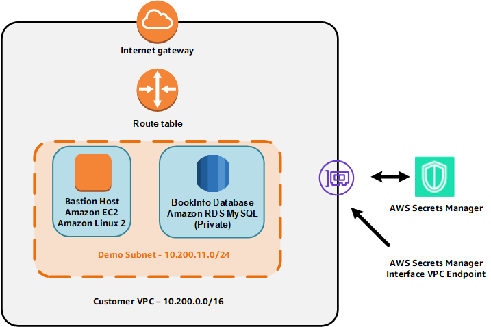
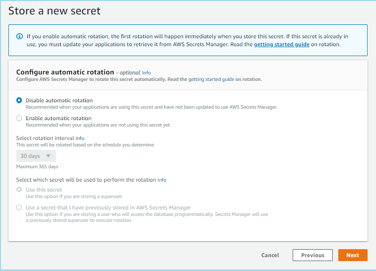
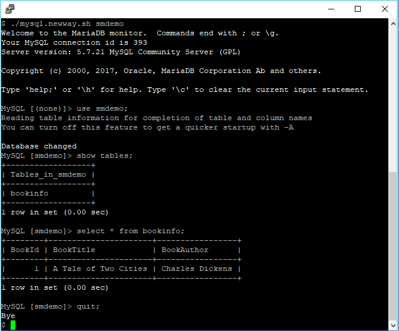

<!--                                                                                       -->
<!-- Copyright 2018 Amazon.com, Inc. or its affiliates. All Rights Reserved.               -->
<!--                                                                                       -->
<!-- Permission is hereby granted, free of charge, to any person obtaining a copy of this  -->
<!-- software and associated documentation files (the "Software"), to deal in the Software -->
<!-- without restriction, including without limitation the rights to use, copy, modify,    -->
<!-- merge, publish, distribute, sublicense, and/or sell copies of the Software, and to    -->
<!-- permit persons to whom the Software is furnished to do so.                            -->
<!--                                                                                       -->
<!-- THE SOFTWARE IS PROVIDED "AS IS", WITHOUT WARRANTY OF ANY KIND, EXPRESS OR IMPLIED,   -->
<!-- INCLUDING BUT NOT LIMITED TO THE WARRANTIES OF MERCHANTABILITY, FITNESS FOR A         -->
<!-- PARTICULAR PURPOSE AND NONINFRINGEMENT. IN NO EVENT SHALL THE AUTHORS OR COPYRIGHT    -->
<!-- HOLDERS BE LIABLE FOR ANY CLAIM, DAMAGES OR OTHER LIABILITY, WHETHER IN AN ACTION     -->
<!-- OF CONTRACT, TORT OR OTHERWISE, ARISING FROM, OUT OF OR IN CONNECTION WITH THE        -->
<!-- SOFTWARE OR THE USE OR OTHER DEALINGS IN THE SOFTWARE.                                -->
<!--                                                                                       -->
# RDS and Fargate Round - RDS Phase

## Overview

In this phase, you will learn how to use AWS Secrets Manager for rotating the password for a private Amazon RDS database. As a reminder, the environment provisioned by CloudFormation is shown in the figure below.   You will not be working with the AWS Fargate container in this phase so it is not shown below.

| **Important** | 
| ---------- | 
| For the sake of simplicity, this tutorial uses jq to parse the secret value into environment variables to allow for easy command line manipulation. This is NOT a security best practice for a production environment. In a production environment, we recommend that you don't store passwords in environment variables.  Click **<a href="https://docs.aws.amazon.com/secretsmanager/latest/userguide/best-practices.html" target="_blank">here</a>** to read about the best practices for using Secrets Manager. |

## View the CloudFormation stack

1. Go to the **<a href="https://console.aws.amazon.com/cloudformation" target="_blank">CloudFormation console</a>** and identify the stack that you built.  Make sure you are in the correct region.  The list of stacks will look similar to the figure below.  The appearance may vary based on the version of the console you are using.  The red arrow points to a link with the name of the CloudFormation stack.

    

2. Click the stack name link to reveal more information about the stack as shown in the figure below.

    

3. Click the Outputs tab as shown in the figure above to list the outputs of the stack which will be similar to the figure below.

    

    The meanings of the output values are described in the table below.

    | Key | Meaning of Value |
    | --- | ---------------- |
    | BastionIP | The IP address of the bastion host |
    | DBInstance | The Amazon RDS instance id |
    | DBPassword | The master password of the RDS data base |
    | DBUser | The master user of the RDS data base |
    | EC2UserPassword | The password for the ec2-user id |
    | ECRRepository | The ECR repository id |
    | ECSCluster | The ECS cluster id |

    You will need the values in the DBInstance, DBPassword, and DBUser outputs in the next section so copy them to a file on your desktop so they are readily available.

## Store the secret

In this section, you will store the RDS database credentials in AWS Secrets Manager.

1. Go to the **<a href="https://console.aws.amazon.com/secretsmanager" target="_blank">Secrets Manager console</a>**.

2. Click **Store a new secret**.

3. Select the **Credentials for RDS database** radio button.

4. Copy the values for the DBUser and DBPassword CloudFormation output values that you got from the CloudFormation stack into the **User name** and **Password** fields respectively.

5. For the encryption key, Secrets Manager gives you the option of using the default KMS key that Secrets Manager creates for your account.  This default key is managed by Secrets Manager itself.  It provides encryption but you do not have the ability manage the policies or grants for the key.  You can also specify your own KMS key which gives you more the option of configuring grants and policies that provide more granular permissions.

    In a production environment that requires fine-grained security controls, you would likely choose your own key.  For this workshop we do not require these additional controls so select **DefaultEncryptionKey** in the dropdown menu.

6. Scroll down to the bottom of the page and you will see a list of your RDS instances.  Select the RDS instance based on the DBInstance CloudFormation output value.

    

7. Click **Next**.

8. Enter a name for the secret.  You can pick a name or just use **smdemo** as shown below.  Note that this must bot be the name of a secret that is pending deletion.

    

9. Click **Next**.

10. Select **Disable automatic rotation** and then click **Next**.   We will enable rotation later in this module.

    

11. Click **Store**.

    You have now stored your secret value as shown below.

    

## Access the database

In this section, you will connect to the bastion host so you can run scripts that the CloudFormation template has created on the instance.  Complete all the steps below unless they are marked "optional."

1. Connect to the bastion host using AWS Systems Manager Session Manager.  To do this:

    1. Go to the **<a href="https://console.aws.amazon.com/systems-manager" target="_blank">Systems Manager console</a>**.
    2. Click **Session Manager**.
    3. Click **Start session**.
    4. Select the radio button for the instance associated with the bastion host.
    5. Click **Start session**.

2. The scripts you will be using are owned by the ec2-user account.  Enter the command below to change your effective user id and directory to those of ec2-user:

        sudo su - ec2-user

4. Display the current directory using this command:

        ls

    You will see two shell scripts.

    * mysql.oldway.sh - This shell script connects to the database the "old" way, using a hard-coded password.
  
    * mysql.newway.sh - This shell script connects to the database the "new" way, using AWS Secrets Manager.
  
5. View the file mysql.oldway.sh using this command:

        cat mysql.oldway.sh

    You will see contents similar to the lines below.  The values PASSWORD, USER, and ENDPOINT represent the hard-coded database password, username, and host endpoint.

        #/bin/bash
        
        # mysql.oldway.sh
        
        # This is the old way of accessing a database, with a hard-coded password.
        # This script will only work right after the CloudFormation template runs.
        # After you store and rotate the secret, you will need to use the
        # mysql.newway.sh script.
    
        mysql \
        -pPASSWORD \
        -u USER \
        -P 3306 \
        -h ENDPOINT

6. Test the script mysql.oldway.sh using the commands shown below.  The first command invokes the script.  The subsequent commands select the database, display the table names in the database, query the rows in the table, and exit MySQL.  Note that MySQL commands end with a semicolon (";").

        ./mysql.oldway.sh
        use smdemo;
        show tables;
        select * from bookinfo;
        quit;
        

    You can see an example of the output below.  This shows that you can access the database, the "old" way, with a hard-coded user name and password. You may be wondering why MariaDB appears in the image below.  Amazon Linux 2 includes the MariaDB port of the **mysql** command as an "extras" module.  The **mysql** program is compatible with both MySQL and MariaDB.

    

7. View the file mysql.newway.sh by entering this command:

        cat mysql.newway.sh

    Take a look at the line below.

        secret=$(aws secretsmanager get-secret-value --secret-id $1 --region us-east-1 | jq .SecretString | jq fromjson)

    The above line uses the AWS CLI to retrieve the secret whose name is passed as a command line argument ($1). The result is a JSON string so the *jq* utility is used to extract the actual value of the secret whose JSON key is named *SecretString*.  Here is an example of what a *SecretString* looks like:

        {
          "engine": "mysql",
          "username": "myuser",
          "password": "mypassword",
          "host": "my-database-endpoint.us-east-1.rds.amazonaws.com",
          "dbname": "myDatabase",
          "port": "3306"
        }

    Note that the *SecretString* itself is a JSON structure.  Now look at the following lines.

        user=$(echo $secret | jq -r .username)
        password=$(echo $secret | jq -r .password)
        endpoint=$(echo $secret | jq -r .host)
        port=$(echo $secret | jq -r .port)
        
    The four lines above show how to use *jq* to extract the database username, password, endpoint, and port from the *SecretString*.  These are then passed to the *mysql* command as shown on the lines below.  Note that there is no space after the -p option.

        mysql \
        -p$password \
        -u $user \
        -P $port \
        -h $endpoint

8. Run the mysql.newway.sh script by running the commands below.  The first command invokes the script.  **Note that you must specify the name of the secret!** In this example, the secret's name is *smdemo*. The subsequent commands select the database, display the table names in the database, query the rows in the table, and exit MySQL.

        ./mysql.newway.sh smdemo
        use smdemo;
        show tables;
        select * from bookinfo;
        quit;

    You can see an example of the output below.  This shows that you can access the database, the "new" way, using AWS Secrets Manager.

    

## Rotate the secret

In this section, you will enable the rotation of the secret you created in AWS Secrets Manager.

1. Go to the **<a href="https://console.aws.amazon.com/secretsmanager" target="_blank">Secrets Manager console</a>**.

2. Click on the secret that you previously created.

3. Click **Edit rotation**.

4. Select **Enable automatic rotation**.

5. Choose **30 days** for the rotation interval.  

6. Select the **Create a new Lambda function to perform rotation** radio button.  This will cause Secrets Manager to build a rotation function using the AWS-provided functions for standard databases.   If you had customized your own rotation function or if you were using a credential for a special application, you would select that here.

7. Enter a name for the rotation function.   In the figure below, we used **smdemo** but you can select whatever you wish.

8. You now need to select the secret whose permissions will be used to rotate the secret.  For this Builder Session, select **Use this secret.**  This will tell the rotation function to access the RDS database using the secret and rotate *the same secret*.

    If your application supports two classes of users, for example a "superuser" and a "normal privilege" user, you could select **Use a secret that I have previously stored in Secrets Manager** and use the "superuser" credential to rotate the credential for the "normal privilege" user.

    Your window should look similar to the figure below.

    

9. Click **Save**.

10. You will see a message telling you that the rotation is beginning and that you should remain on the page until it is complete. AWS Secrets Manager is now using the [AWS Serverless Application Repository](https://aws.amazon.com/serverless/serverlessrepo/) to install an [AWS Lambda rotation](https://aws.amazon.com/lambda/) function on your behalf.  **Do not leave this page until the rotation is complete.**

    

    A message will appear when the rotation is complete.  **Refresh your browser window to update your any cached fields.**

    

11. Click **Retrieve secret value** to see the new password value.

## Access the database

Let's try to connect to the database again, both the "old" way with a hard-coded password, the "new" way with AWS Secrets Manager.

1. On the bastion host, run the command below to access the database using the hard-coded password.

        ./mysql.oldway.sh

    You should receive an error message (access denied) because the mysql.oldway.sh script has the same hard-coded password.

    

2. Run the commands below to access the database with Secrets Manager by running the commands below.  **Note that you must specify the name of the secret!** In this example, the secret's name is *smdemo*.  You should be able to access the database as you did before because Secrets Manager fetches the new credential rather than using a hard-coded credential.

        ./mysql.newway.sh smdemo
        use smdemo;
        show tables;
        select * from bookinfo;
        quit;

You have completed ths RDS phase and have learned how to use AWS Secrets Manager with Amazon RDS.  You will now continue to the Fargate phase. 
