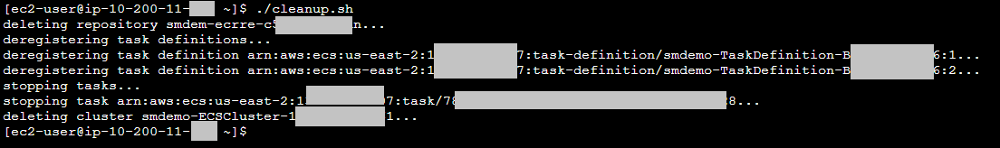

# Using AWS Secrets Manager with Amazon RDS and AWS Fargate - Clean Up Phase

!!! info "If you are at an *AWS event* where the *Event Engine* is being used, you are done!  Clean up is handled automatically." 

??? info  "Click here if you are using your own account or at an AWS event and Event Engine is *not* being used." 

    Now that you have seen how AWS Secrets Manager can rotate the credentials for a private database and with AWS Fargate, please follow these steps to remove the resources you created, including the private database.

    1. If you do not have a session open to the bastion host, then connect to the bastion host using AWS Systems Manager Session Manager.  To do this:

        1. Go to the **<a href="https://console.aws.amazon.com/systems-manager" target="_blank">Systems Manager console</a>**.
        2. Click **Session Manager**.
        3. Click **Start session**.
        4. Select the radio button for the instance associated with the bastion host.
        5. Click **Start session**.

    2. The scripts you will be using are owned by the ec2-user account.  If you are not currently using ec2-user as your effective user id, then enter the command below to change your effective user id and directory to those of ec2-user:

        sudo su - ec2-user

    3. Run the command below to perform the Fargate clean up tasks.

        ./cleanup.sh

        The command will stop any Fargate Tasks, ungregister task definitions, and delete the Amazon ECS cluster and the Amazon ECR repository.  The output will be similar to that shown in the figure below.

        

    4. **<a href="https://docs.aws.amazon.com/secretsmanager/latest/userguide/manage_delete-restore-secret.html?shortFooter=true" target="_blank">Delete the secret you created in Secrets Manager</a>**.  Check the region for the console to make sure you are operating in the region in which the CloudFormation stack was deployed.  Note that when you delete a secret, the deletion is scheduled for a minimum of seven days in the future. 

    5. When you enabled rotation on your secret, AWS Secrets Manager used AWS CloudFormation to create an AWS Lambda function to do the rotation using the AWS Serverless Application Repository.  Go to the AWS CloudFormation console and delete this stack. The name of the stack begins with the following string:

        **aws-serverless-repository-SecretsManagerRDSMySQLRotationSingleUser**

        Look for a stack with this naming convention that was created at about the same time as you enabled rotation.  **Do not proceed to the next step until this stack has been deleted.**  The stack deletion process may take as much as one hour because of Lambda-related network activity.

    6. **<a href="https://docs.aws.amazon.com/AWSCloudFormation/latest/UserGuide/cfn-console-delete-stack.html" target="_blank">Delete the main CloudFormation stack</a>**.  The stack deletion process may take several minutes to complete.  If the stack deletion process either pauses or fails, it may be because of an Elastic Network Interface that gets created when rotation is enabled.  In this case, **<a href="https://docs.aws.amazon.com/AWSEC2/latest/UserGuide/using-eni.html" target="_blank">delete the Elastic Network Interface</a>** and try deleting the CloudFormation stack again.
