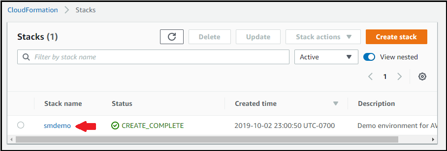
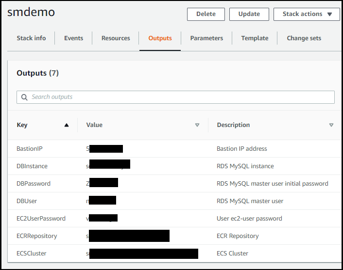
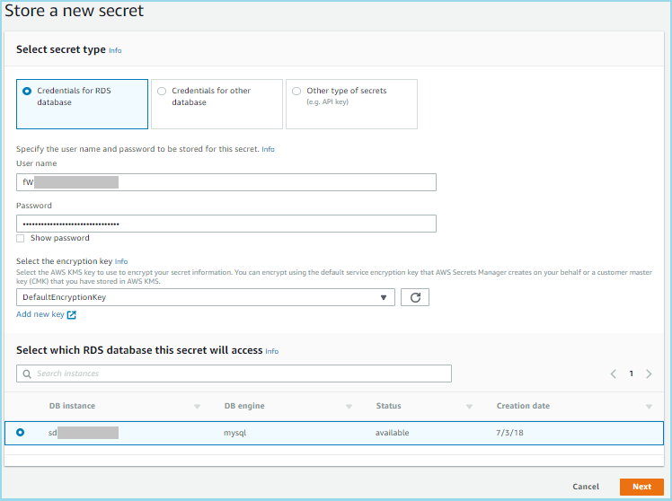
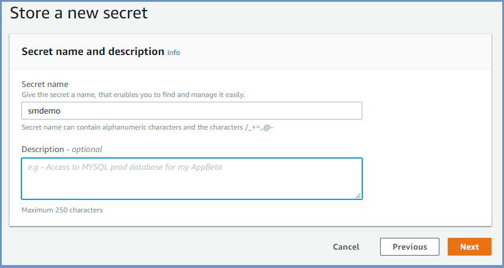

<!--                                                                                       -->
<!-- Copyright 2018 Amazon.com, Inc. or its affiliates. All Rights Reserved.               -->
<!--                                                                                       -->
<!-- Permission is hereby granted, free of charge, to any person obtaining a copy of this  -->
<!-- software and associated documentation files (the "Software"), to deal in the Software -->
<!-- without restriction, including without limitation the rights to use, copy, modify,    -->
<!-- merge, publish, distribute, sublicense, and/or sell copies of the Software, and to    -->
<!-- permit persons to whom the Software is furnished to do so.                            -->
<!--                                                                                       -->
<!-- THE SOFTWARE IS PROVIDED "AS IS", WITHOUT WARRANTY OF ANY KIND, EXPRESS OR IMPLIED,   -->
<!-- INCLUDING BUT NOT LIMITED TO THE WARRANTIES OF MERCHANTABILITY, FITNESS FOR A         -->
<!-- PARTICULAR PURPOSE AND NONINFRINGEMENT. IN NO EVENT SHALL THE AUTHORS OR COPYRIGHT    -->
<!-- HOLDERS BE LIABLE FOR ANY CLAIM, DAMAGES OR OTHER LIABILITY, WHETHER IN AN ACTION     -->
<!-- OF CONTRACT, TORT OR OTHERWISE, ARISING FROM, OUT OF OR IN CONNECTION WITH THE        -->
<!-- SOFTWARE OR THE USE OR OTHER DEALINGS IN THE SOFTWARE.                                -->
<!--                                                                                       -->
# RDS and Fargate Round - Fargate Phase

## Overview

In this phase, you will learn how to use AWS Secrets Manager with AWS Fargate. As a reminder, the environment provisioned by CloudFormation is shown in the figure below.

| **Security Note** | 
| ---------- | 
| |
|**_For the sake of simplicity, this tutorial uses jq to parse the secret value into environment variables to allow for easy command line manipulation. This is NOT a security best practice for a production environment. In a production environment, we recommend that you don't store passwords in environment variables._**|

## View the CloudFormation stack

1. Go to the CloudFormation console and identify the stack that you built.  The list of stacks will look similar to the figure below.  The appearance may vary based on the version of the console you are using.  The red arrow points to a link with the name of the CloudFormation stack.

    

2. Click the stack name link to reveal more information about the stack as shown in the figure below.

    

3. Click the Outputs tab as shown in the figure above to list the outputs of the stack which will be similar to the figure below.

    

    The meanings of the output values are described in the table below.

    | Key | Meaning of Value |
    | --- | ---------------- |
    | BastionIP | The IP address of the bastion host |
    | DBInstance | The Amazon RDS instance id |
    | DBPassword | The master password of the RDS data base |
    | DBUser | The master user of the RDS data base |
    | EC2UserPassword | The password for the ec2-user id |
    | ECRRepository | The ECR repository id |
    | ECSCluster | The ECS cluster id |

    You will need the values in the DBInstance, DBPassword, and DBUser outputs in the next section so copy them to a file on your desktop so they are readily available.

4. Copy the values for the DBUser and DBPassword CloudFormation output values that you got from the CloudFormation stack into the **User name** and **Password** fields respectively.   Scroll down to the bottom of the page and you will see a list of your RDS instances.  Select the RDS instance based on the DBInstance CloudFormation output value.

    

5. Click **Next**.

6. Enter a name for the secret.  You can pick a name or just use **smdemo** as shown below.  Note that this must bot be the name of a secret that is pending deletion.

    

7. Click **Next**.

8. Select **Disable automatic rotation** and then click **Next**.   We will enable rotation later in this module.

    

9. Click **Store**.

    You have now stored your secret value as shown below.

    

## Access the database before the rotation

In this section, you will connect to the bastion host so you can run scripts that the CloudFormation template has created on the instance.  Complete all the steps below unless they are marked "optional."

1. Connect to the bastion host using AWS Systems Manager Session Manager.

2. After you login, use the **sudo su ec2-user** command since the ec2-user id is the owner of all the scripts.

3. Change to the home directory of the ec2-user id by entering the **cd** command without any arguments.

4. Use the **ls** command to list the contents of the home directory.  You will see two shell scripts.

    * mysql.oldway.sh - This shell script connects to the database the "old" way, using a hard-coded password.
  
    * mysql.newway.sh - This shell script connects to the database the "new" way, using AWS Secrets Manager.
  
5. Let's take a look at the file mysql.oldway.sh.  You can use the **cat** command to do this.  In the example below, the values PASSWORD, USER, and ENDPOINT represent the hard-coded database password, username, and host endpoint.

        #/bin/bash
        
        # mysql.oldway.sh
        
        # This is the old way of accessing a database, with a hard-coded password.
        # This script will only work right after the CloudFormation template runs.
        # After you store and rotate the secret, you will need to use the
        # mysql.newway.sh script.
    
        mysql \
        -pPASSWORD \
        -u USER \
        -P 3306 \
        -h ENDPOINT

6. Now let's try this script by running the following commands.  The first command invokes the script.  The subsequent commands select the database, display the table names in the database, query the rows in the table, and exit MySQL.

        ./mysql.oldway.sh
        use smdemo;
        show tables;
        select * from bookinfo;
        quit;

    You can see an example of the output below.  This shows that you can access the database, the "old" way, with a hard-coded user name and password. You may be wondering why MariaDB appears in the image below.  Amazon Linux 2 includes the MariaDB port of the **mysql** command as an "extras" module.  The **mysql** program is compatible with both MySQL and MariaDB.

    

7. Let's take a look at the file mysql.newway.sh.  You can use the **cat** command to do this.  As mentioned above, for the sake of simplicity, the scripts used in the tutorial use *jq* to parse the secret value into shell variables to allow for easy command line manipulation. This is NOT a security best practice for a production environment. In a production environment, we recommend that you don't store passwords in environment variables, and work with them in plaintext at the command line.

        #/bin/bash
        
        # This is the new way of accessing a database, with AWS Secrets Manager.
        
        if [ $# -ne 1 ]
        then
          echo usage: $0 SecretName
          exit 1
        fi
        
        secret=$(aws secretsmanager get-secret-value --secret-id $1 --region us-east-1 | jq .SecretString | jq fromjson)
        user=$(echo $secret | jq -r .username)
        password=$(echo $secret | jq -r .password)
        endpoint=$(echo $secret | jq -r .host)
        port=$(echo $secret | jq -r .port)
        
        mysql \
        -p$password \
        -u $user \
        -P $port \
        -h $endpoint

8. Now let's try this script by running the following commands.  The first command invokes the script.  **Note that you must specify the name of the secret!** The subsequent commands select the database, display the table names in the database, query the rows in the table, and exit MySQL.

        ./mysql.newway.sh smdemo
        use smdemo;
        show tables;
        select * from bookinfo;
        quit;

    You can see an example of the output below.  This shows that you can access the database, the "new" way, using AWS Secrets Manager.

    

## Rotate the secret

In this section, you will enable the rotation of the secret you created in AWS Secrets Manager.

1. Go to the main screen of the AWS Secrets Manager console.

2. Click on the secret that you previously created.

3. Click **Edit rotation**.

4. Select **Enable automatic rotation**. Choose **30 days** for the rotation interval.  Click **Use this secret** because we will be using the credentials of this secret to access the database and then rotate the same credentials.  Click **Save** to begin the process.

    

5. You will see a message telling you that the rotation is beginning and that you should remain on the page until it is complete. AWS Secrets Manager is now using the [AWS Serverless Application Repository](https://aws.amazon.com/serverless/serverlessrepo/) to install an [AWS Lambda rotation](https://aws.amazon.com/lambda/) function on your behalf.  **Do not leave this page until the rotation is complete.**

    

    A message will appear when the rotation is complete.  **Refresh your browser window to update your any cached fields.**

    

6. Click **Retrieve secret value** to see the new password value.

## Access the database after the rotation

Let's try to connect to the database again, both the "old" way with a hard-coded password, the "new" way with AWS Secrets Manager.

1. On the bastion host, repeat step 4.6 with the **mysql.oldway.sh** script.   You should receive an error message (access denied) because the mysql.oldway.sh script has the same hard-coded password.

    

2. Repeat step 4.8 with the **mysql.newway.sh** script.   You should be able to connect to the database just as you did before since this script uses AWS Secrets Manager to fetch the updated credentials.

## Conclusion

You have completed ths Fargate phase and have learned how to use AWS Secrets Manager with AWS Fargate. Please proceed to the Clean up phase to remove the environment created by AWS CloudFormation.
